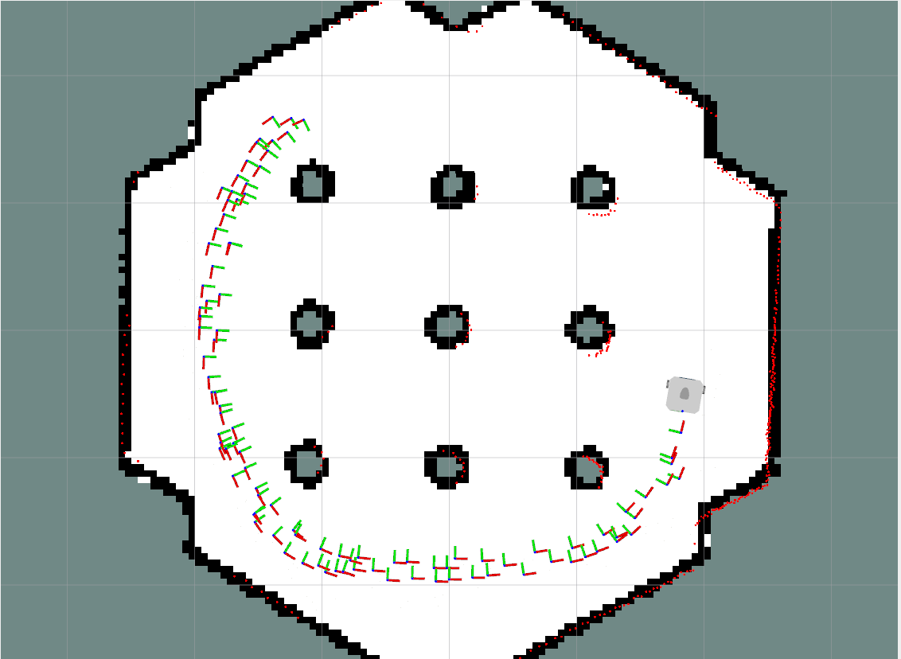
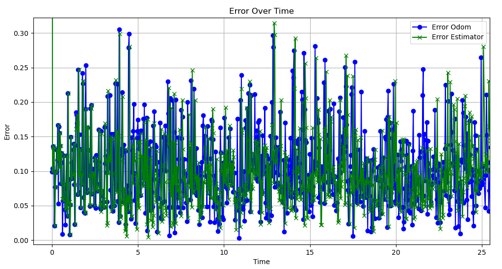

# Robot localization with GTSAM
Project for course "Artificial Intelligence in Robotics"

## Table of Contents
- [Robot localization with GTSAM](#robot-localization-with-gtsam)
  - [Table of Contents](#table-of-contents)
  - [1. About the project](#1-about-the-project)
    - [Goal of the project](#goal-of-the-project)
    - [Sensors](#sensors)
  - [2. Installing the dependencies](#2-installing-the-dependencies)
    - [Create a workspace](#create-a-workspace)
    - [a.) Using Ubuntu 22.04 and ROS2 Humble (without Docker)](#a-using-ubuntu-2204-and-ros2-humble-without-docker)
      - [Install the following modules](#install-the-following-modules)
    - [b.) With Docker](#b-with-docker)
      - [Building the container](#building-the-container)
      - [Starting the container](#starting-the-container)
        - [Opening more terminals in the container](#opening-more-terminals-in-the-container)
  - [3. Running the simulation](#3-running-the-simulation)
    - [Workspace preparation](#workspace-preparation)
    - [Build the package](#build-the-package)
    - [Start the simulation](#start-the-simulation)
  - [4. Running the experiment](#4-running-the-experiment)
  - [5. Results](#5-results)
  - [References](#references)

## 1. About the project

### Goal of the project
Goal of the project was to prepare a state estimator using graph optimization for sensor fusion. To accomplish that the [GTSAM library](https://gtsam.org/) [[1]](#1) was chosen.

### Sensors
For the project we chose to simulate a [TurtleBot3 Waffle](https://www.turtlebot.com/turtlebot3/) in [Gazebo simulator](https://docs.ros.org/en/humble/Tutorials/Advanced/Simulators/Gazebo/Simulation-Gazebo.html). The 3 sensors used to create a factor graph were:
- Odometry,
- IMU,
- LiDAR.

From odometry the position and orientation was available straight away, from IMU it was enough to integrate the linear acceleration twice to get the position and to integrate angular velocity once to receive the orientation. LiDAR returns distance to obstacles around the robot, so those values were used to create a point cloud. ICP (Iterative closest point) algorithm [[2]](#2) uses two consecutive point clouds and finds the rotation matrix and translation vector between them (we chose the [Open3D](https://github.com/isl-org/Open3D) [[3]](#3) implementation of the algorithm).

## 2. Installing the dependencies

### Create a workspace

```
mkdir ~/turtlebot_localization_ws && cd ~/turtlebot_localization_ws
```

```
git clone https://github.com/mmcza/Robot-localization-with-GTSAM
```

### a.) Using Ubuntu 22.04 and ROS2 Humble (without Docker)

#### Install the following modules

```
sudo apt-get install -y ros-humble-turtlebot3-gazebo && sudo apt-get install -y ros-humble-nav2-bringup && sudo apt-get install -y ros-humble-navigation2 && sudo apt-get install -y ros-humble-gtsam && sudo apt-get install -y python3-pip
```
```
pip install open3d && pip install gtsam && pip install numpy==1.24.4
```

### b.) With Docker

#### Building the container

```
cd Robot-localization-with-GTSAM && docker build -t robot_localization .
```
#### Starting the container
```
bash start_container.sh 
```

##### Opening more terminals in the container
```
docker exec -ti robot_localization bash
```

> [!NOTE]
> The `robot_localization_ws` directory is shared between the host and container. In the result files inside of it might require sudo privileges to save any changes.

> [!NOTE]
> Dockerfile and script for running container are based on [Rafał Staszak's repository](https://github.com/RafalStaszak/NIMPRA_Docker/)

## 3. Running the simulation

### Workspace preparation

To make the project work we need to prepare the Gazebo simulator properly

```
source /opt/ros/humble/setup.bash
```
```
export TURTLEBOT3_MODEL=waffle
```
```
export GAZEBO_MODEL_PATH=$GAZEBO_MODEL_PATH:/opt/ros/humble/share/turtlebot3_gazebo/models
```
```
source /usr/share/gazebo/setup.bash
```

### Build the package
Inside of your workspace (NOT inside your src)

```
colcon build --symlink-install
```
```
source install/setup.bash
```

### Start the simulation

In first terminal start the estimator 
```
ros2 run robot_localization estimator
```

In second terminal start the simulator

```
ros2 launch nav2_bringup tb3_simulation_launch.py headless:=False
```

## 4. Running the experiment

After launching the estimator and simulator you have to estimate the initial position (by clicking specific button and placing arrow inside RVIZ) and add a goal (so the robot start to move). You can also visualize the estimated state of the robot.


Position and orientation of the robot (from estimator, ground truth from gazebo and odometry) is also saved to `trajectory.csv` file, so it's possible to display it and check the results after the experiment has ended.


## 5. Results

Due to the fact that the Odometry was returning basically same results as real position of the robot, there was added an additional noise with normal distribution ($\mu = 0, \:\sigma=0.1$) to robot's position. After that the noisy position was used as the reference to be optimized.

A comparision of Odometry error (with noise) and error from our estimator can be seen on the plot below


Table with parameters for both errors (additionally after removing first measurement as it was completely different for the estimator) - calculated using [Pandas describe() method](https://pandas.pydata.org/docs/reference/api/pandas.DataFrame.describe.html).

|Parameter | Estimator  | Odometry | Estimator >0s | Odometry >0s |
| ---------| -----------| ---------| ------------- | ------------ |
| count    | 736        | 736      | 735           | 735          |
| mean     | 0.099232   | 0.104481 | 0.096562      | 0.104488     |
| std      | 0.088873   | 0.056087 | 0.051536      | 0.056125     |
| min      | 0.004427   | 0.002932 | 0.004427      | 0.002932     |
| 25%      | 0.059396   | 0.062254 | 0.059389      | 0.062188     |
| 50%      | 0.086959   | 0.095967 | 0.086887      | 0.095914     |
| 75%      | 0.122585   | 0.135575 | 0.122386      | 0.135611     |
| max      | 2.061525   | 0.304993 | 0.314617      | 0.304993     |

The estimator without the intial position has lowest values for all parameters apart from it's outliers - `min` and `max` (what is interesting because both `top 25%` and `top 75%` are the lowest). The mean value of odometry's error is ~8% bigger than the mean error of estimator. 

Based on the data from the table, it is noticeable that the estimator does its job and reduces the noise.

## References

<a id="1">[1]</a> Dellaert, F. and GTSAM Contributors borglab/gtsam v.4.2a8. Georgia Tech Borg Lab (2022). https://github.com/borglab/gtsam, https://doi.org/10.5281/zenodo.5794541

<a id="2">[2]</a>  Zhang, Z. Iterative point matching for registration of free-form curves and surfaces. Int J Comput Vision 13, 119–152 (1994). https://doi.org/10.1007/BF01427149

<a id="3">[3]</a>  Zhou, Q. and Park, J. and Koltun, V. Open3D: A Modern Library for 3D Data Processing. arXiv (2018). https://doi.org/10.48550/arXiv.1801.09847